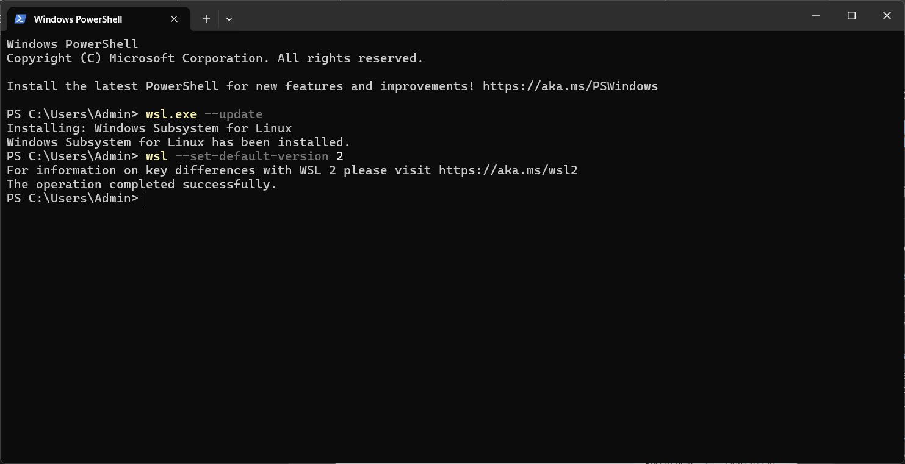
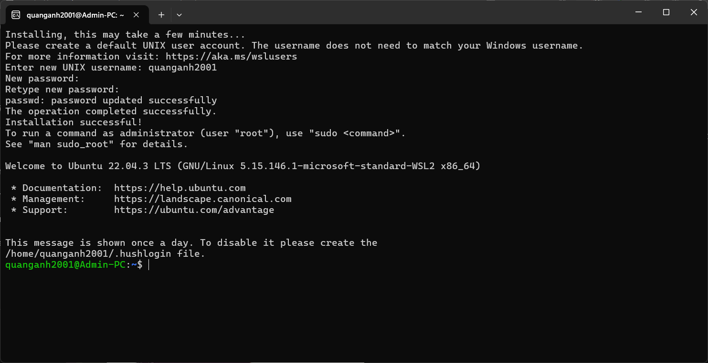
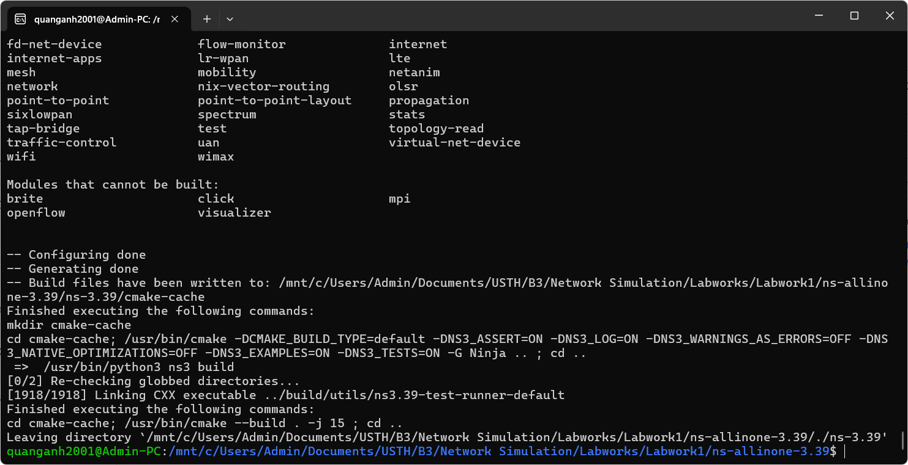
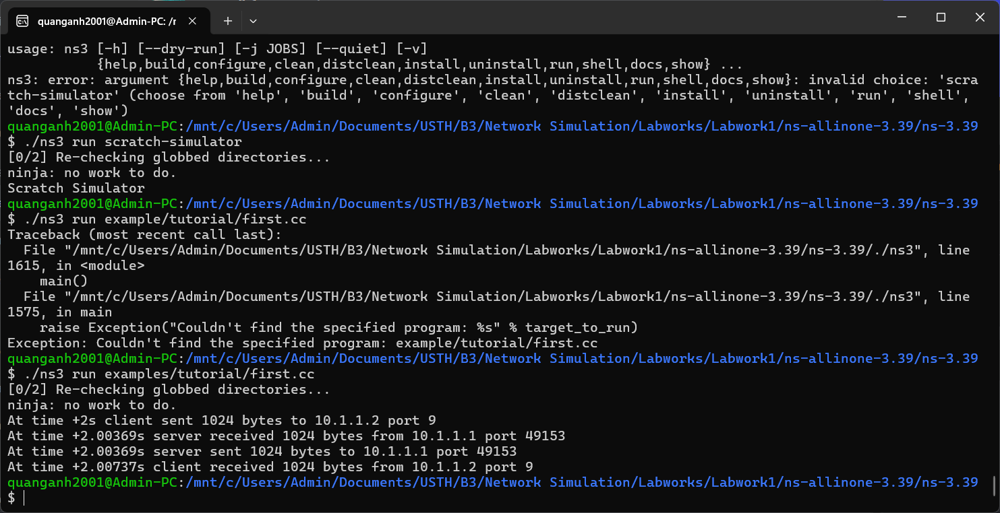

Consider a C++ program ../ns-3.39/example/tutorial/first.cc in the source code of NS-3 (you installed in your computer)

- [Run the program](#run-the-program)
- [Explain the scenario](#explain-the-scenario)
- [What protocols are implemented in the example?](#what-protocols-are-implemented-in-the-example)
- [What are the sender and receiver? How network traffic is generated?](#what-are-the-sender-and-receiver-how-network-traffic-is-generated)

Please submit a PDF file. Name convention: StudentID_YourName.pdf

**My solution**

# Run the program

You can run Ubuntu in VMWare Workstation virtual machine

But in this labwork, I go to Microsoft Store download Ubuntu 22.04.3 LTS

But before install Ubuntu, you should enable WSL (Windows Subsystem for Linux) and Virtual Machine Platform. Then go to Windows PowerShell run `wsl.exe --update`. Set default WSL 2: `wsl --set-default-version 2`



Then run Ubuntu again, and the result is:



The first command to do is (You can just copy-paste the following in your terminal window). I am using VMware virtual machine

`sudo apt update`

```bash
sudo apt install g++ python3 cmake ninja-build git gir1.2-goocanvas-2.0 python3-gi python3-gi-cairo python3-pygraphviz gir1.2-gtk-3.0 ipython3 tcpdump wireshark sqlite sqlite3 libsqlite3-dev qtbase5-dev qtchooser qt5-qmake qtbase5-dev-tools openmpi-bin openmpi-common openmpi-doc libopenmpi-dev doxygen graphviz imagemagick python3-sphinx dia imagemagick texlive dvipng latexmk texlive-extra-utils texlive-latex-extra texlive-font-utils libeigen3-dev gsl-bin libgsl-dev libgslcblas0 libxml2 libxml2-dev libgtk-3-dev lxc-utils lxc-templates vtun uml-utilities ebtables bridge-utils libxml2 libxml2-dev libboost-all-dev ccache
```

Let the installation run, in the meantime, we will download ns3 from the website [nsnam.org](http://nsnam.org/). I will choose NS-3 version is 3.39

Type: `wget https://www.nsnam.org/releases/ns-allinone-3.39.tar.bz2`. Then extract file.

Go to:

```bash
cd ns-allinone-3.39/
./build.py --enable-examples --enable-tests
```

(This above line will install all the packages for ns3 along with netanim, flow monitor, protocol, applications, etc.)
Depending on your system, the time can be anywhere between 20 minutes to sometimes 1 hour (in the case I use network from USTH networks, so network speed may be slow times)



It took 45 minutes to complete installation. To check whether they are working, use the following command:

```bash
cd ns-allinone-3.39/ns-3.39/
./ns3 run hello-simulator
./ns3 run scratch-simulator
```

Try C++ program tutorial:

```bash
./ns3 run example/tutorial/first.cc
```

After running the program, this is the result:



# Explain the scenario

IP address of the client is 10.1.1.1

IP address of the server is 10.1.1.2

- Firstly, the client sent a request which is 1024 bytes to the server by port 9
- Then, the server received the request at port 49153
- As soon as possible, the server sent a response back to the client with the same port 49153
- Finally, the server received the response from port 9

# What protocols are implemented in the example?

- UDP - User Datagram Protocol and IPv4 - Internet Protocol version 4 are the protocols implemented in the example

# What are the sender and receiver? How network traffic is generated?

- The sender is the client and the receiver is the server
- The network traffic is generated by a single point-to-point link between two nodes.
- With two applications are UdpEchoServerHelper and UdpEchoClientHelper, it helps us to generate traffic.