- [A. Logging](#a-logging)
- [B. Editing attributes](#b-editing-attributes)
- [C. Capture packet traces](#c-capture-packet-traces)
- [D. Report results](#d-report-results)

Consider a C program ../ns-3.39/example/tutorial/first.cc

Your can comeback last labwork: [Labwork 1: Running the first script](../Labwork1/README.md) 

# A. Logging

Enable Logging LEVEL_FUNCTION and list out functions of the class UdpEchoServer and UdpEchoClient that are called during the execution of the script.

**Solution:** To enable logging `LEVEL_FUNCTION`, add the following code in the main function of “first.cc” file:

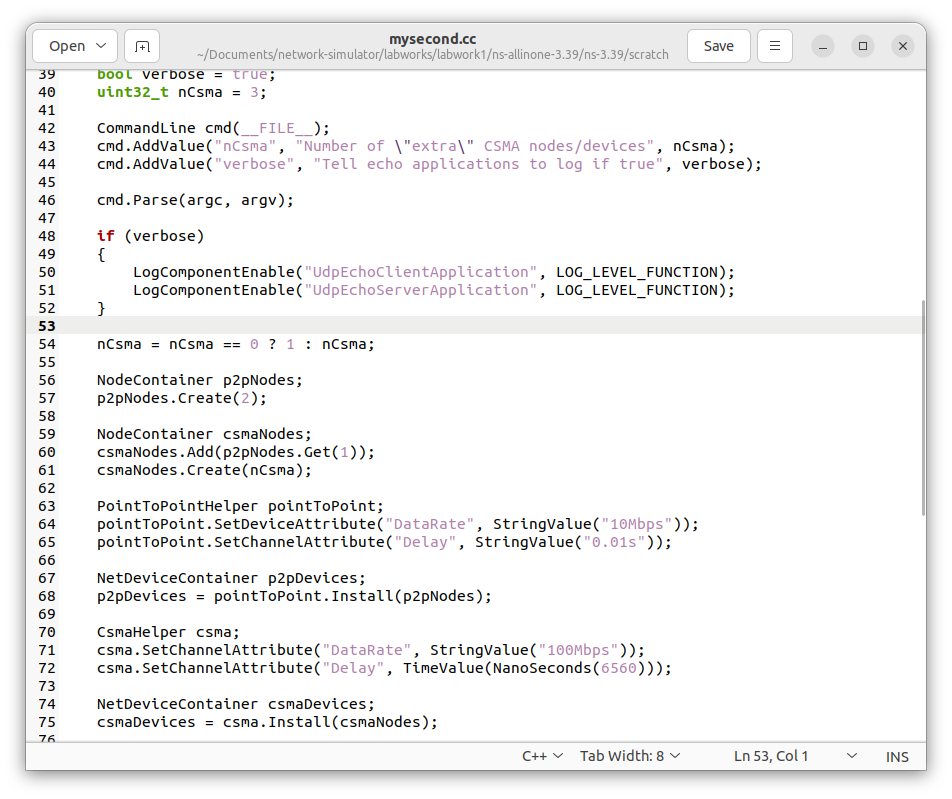

```cpp
LogComponentEnable("UdpEchoClientApplication", LOG_LEVEL_FUNCTION);
LogComponentEnable("UdpEchoServerApplication", LOG_LEVEL_FUNCTION);
```

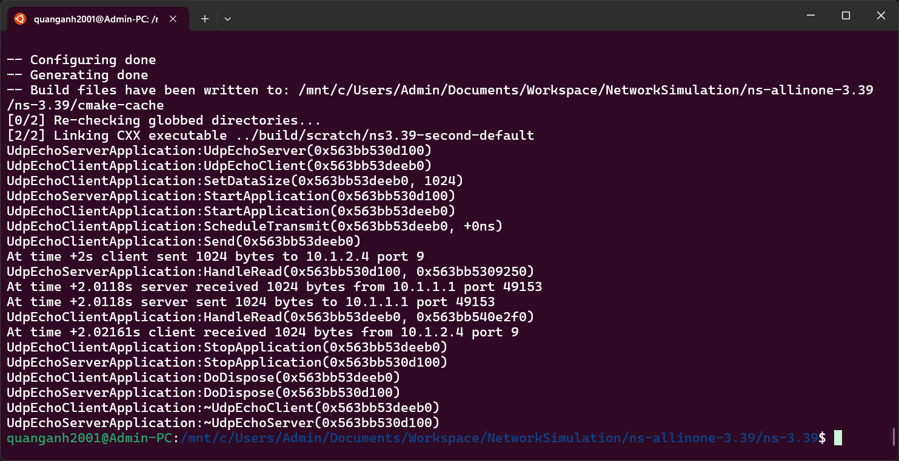

To list out functions of the class `UdpEchoServer` and `UdpEchoClient` that are called during the execution of the script, run the following command in the terminal after building after building the program:

```cpp
./ns3 run scratch/second.cc --command-template="%s PrintHelp"
```

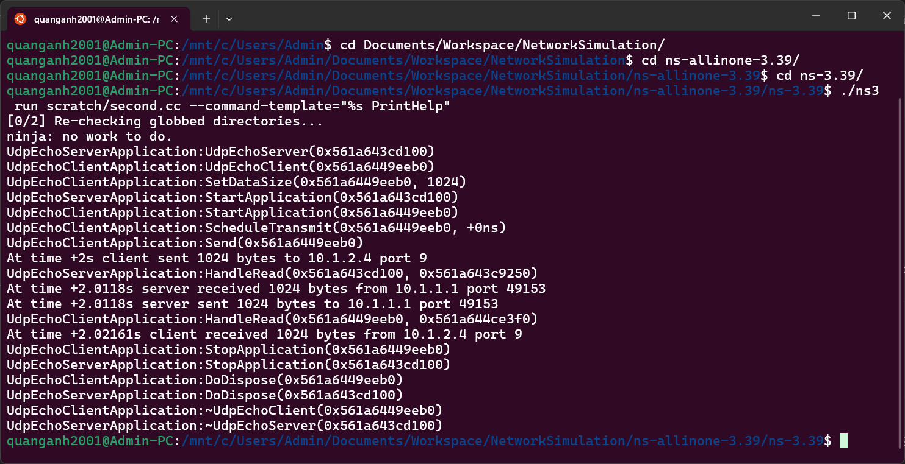

# B. Editing attributes

1. Edit the code to set up properties of the point-to-point network device and channel:
- Date rate = 10Mbps
- Propagation delay = 0.01s

**Solution:** To edit the code and set up properties of the point-to-point network device and channel (data rate = 10Mbps, propagation delay = 0.01s), add the following code in the main function of `second.cc` file:

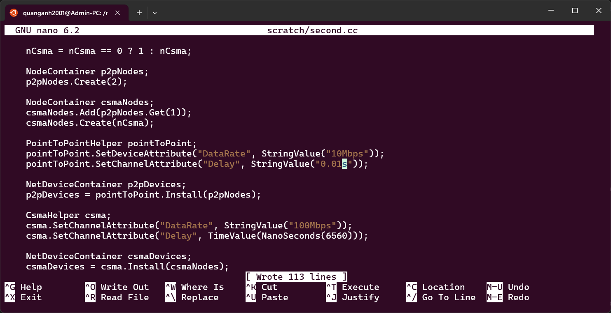

```cpp
PointToPointHelper pointToPoint;
pointToPoint.SetDeviceAttribute("DataRate", StringValue("10Mbps"));
pointToPoint.SetChannelAttribute("Delay", StringValue("0.01s"));
```

2. Run the updated script and compute the average delay of received packets at the server and client.

**Solution:** To run the updated script and compute the average delay of received packets at the server and client, run the following command in the terminal after building the program:

```cpp
./ns3 run "scratch/second.cc udpClientRecv=1"
```

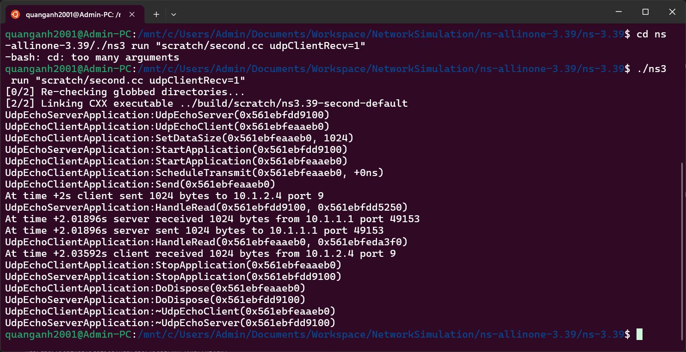

Delay of received packets at the server is: 2.01896 - 2.0118s = 0.00716s

Delay of received packets at the client is: 0.03592s - 0.02161s = 0.014131s

The average delay = 0.0106455s

3. Using command line arguments to
- Set number of sending packets to 100: `./ns3 run "scratch/mysecond.cc udpClientCount=100 udpClientRecv=1"`
- Edit point-to-point network device and channel attributes to (5Mbps, 1ms) and (10Mbps, 0.01s)

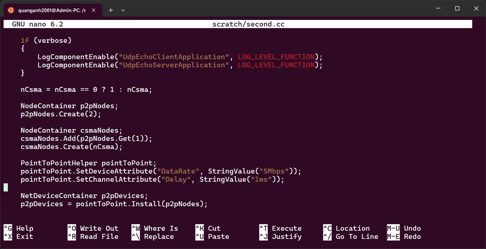

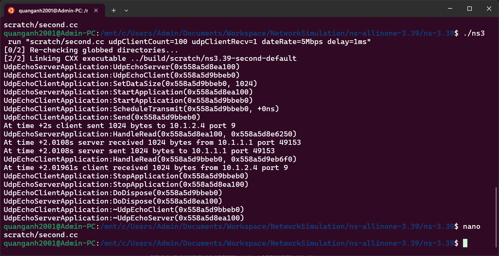

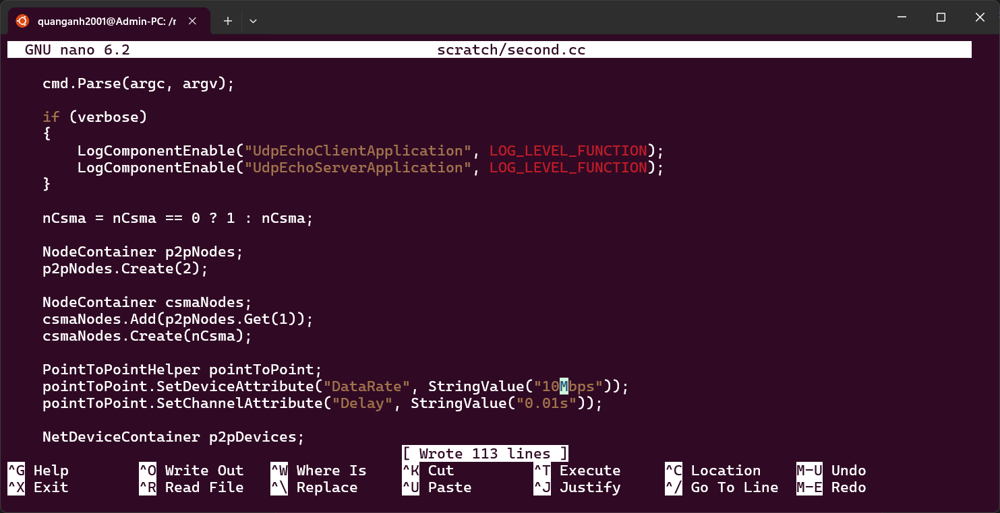

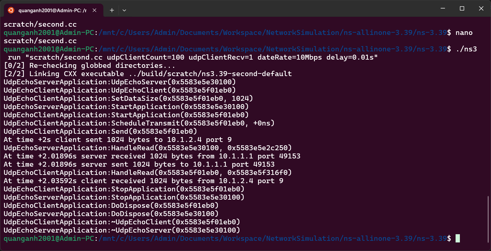

```cpp
./ns3 run "scratch/second.cc udpClientCount=100 udpClientRecv=1 dateRate=5Mbps delay=1ms"
./ns3 run "scratch/second.cc udpClientCount=100 udpClientRecv=1 dateRate=10Mbps delay=0.01s"
```

- Compare the average delay of received packets at server and client for two above parameter sets: Same the code

# C. Capture packet traces

Traces include information of sent and received packets (time, size, other, information).

1. ASCII tracing: output the trace to text file

**Solution:** To output the trace to a text file in ASCII format, add the following code in the main function of “second.cc” file:

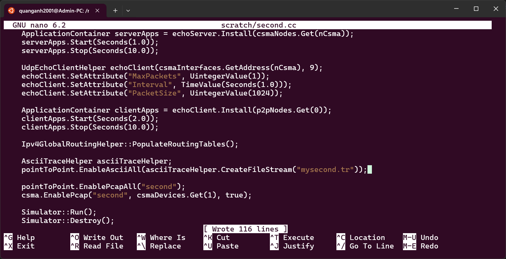

1. PCAP tracing:
- Capturing sent and received packets: .pcap file format

**Solution:** To capture sent and received packets in PCAP format, add the following code in the main function of “mysecond.cc” file: `pointToPoint.EnablePcapAll("second");`

- Read the output: by tcpdump or wireshark

**Solution:** To read the output using tcpdump, run the following command in the terminal: `tcpdump -r second-0-0.pcap`

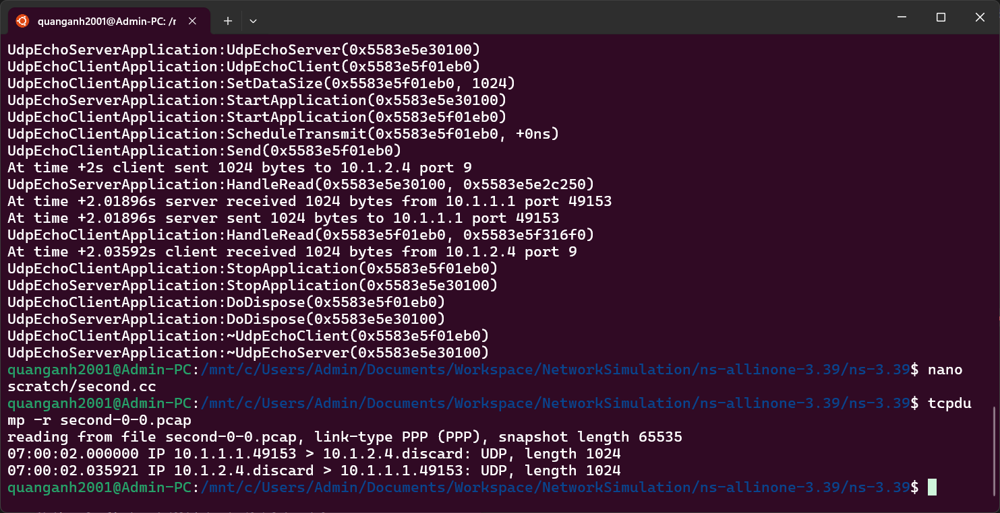

To read the output using Wireshark, open the “mysecond-0-0.pcap” file in Wireshark:

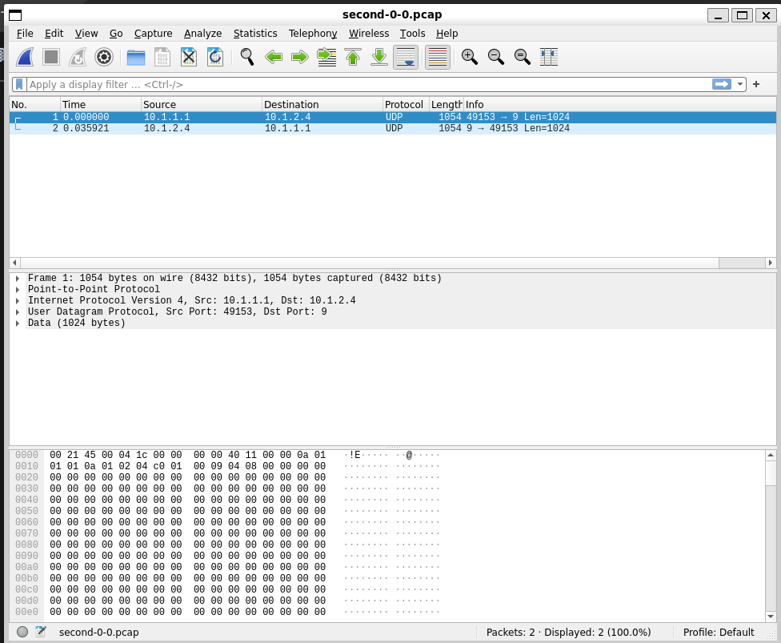

# D. Report results

From the traces of two parameter sets in B, compute:

1. Average delay of received packets at client and server
- Average delay of received packets at the client is: 0.03592s
- Average delay of received packets at server is: 0s.
2. Packet delivery ratio

Packet delivery ratio = number of packets sent / number of packets received = 1